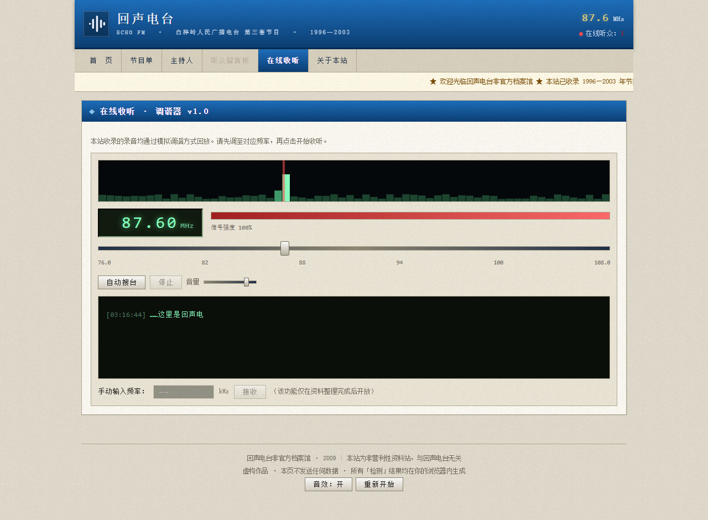
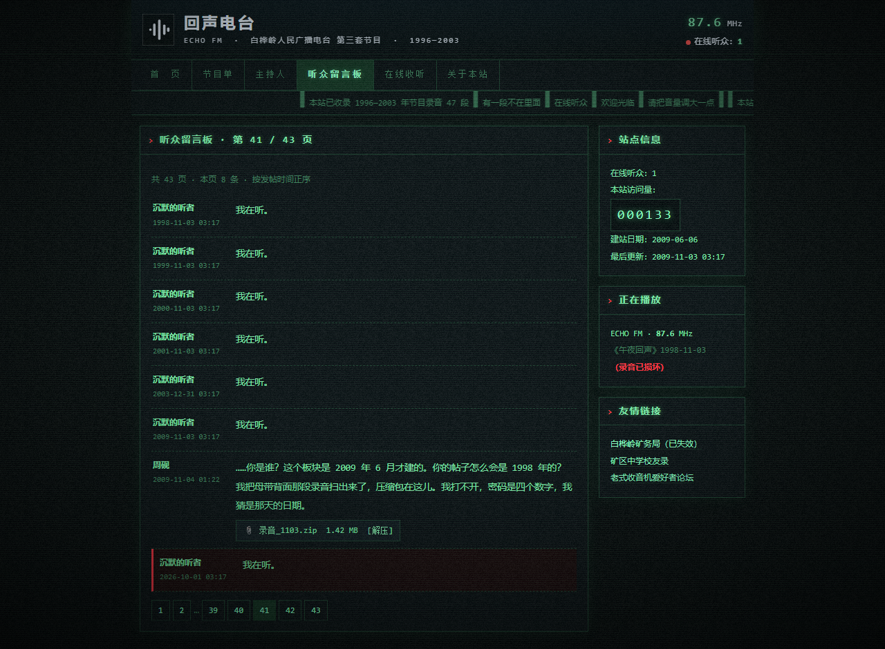
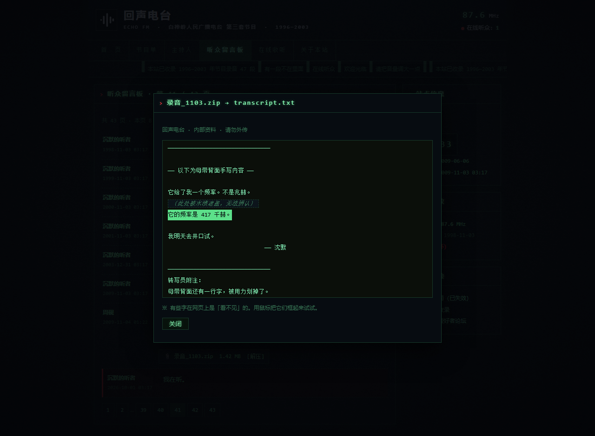
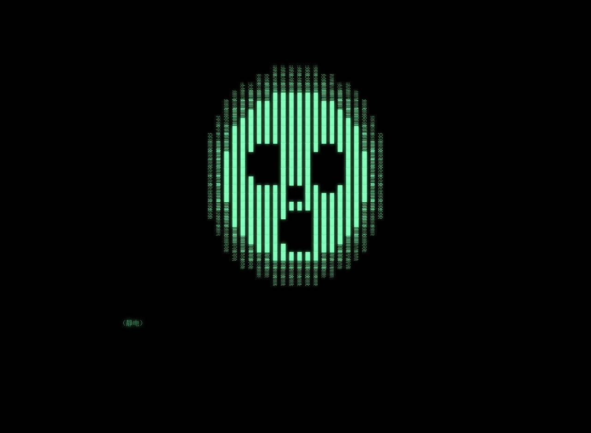
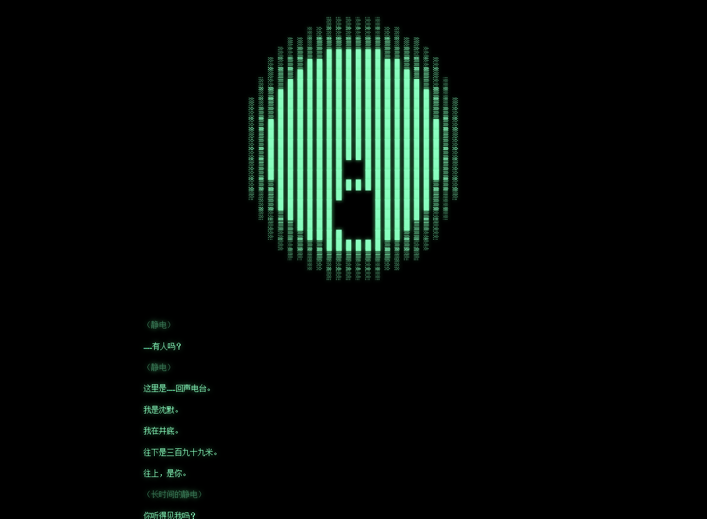

# 回声电台 ECHO FM · 87.6 恐怖 ARG

> 「电台不是用来发射的，是用来等回音的。」

**▶ 在线游玩：<https://6588-gjs.github.io/echo876-arg/>**

一个伪装成 **2009 年听众自建的地方电台档案馆** 的恐怖解谜网页。

白天，它是一套俗气又怀旧的 2000 年代门户网站皮肤：天蓝渐变标题栏、宋体、跑马灯公告、红字访客计数器。
当你在「在线收听」里把老式收音机的刻度调到 **87.6**，听完 1998 年那期《午夜回声》之后——
**整个网站会当场裂开**，变成深夜静电态。

全部内容在 **一个 `index.html` 里**：零外部资源、零构建、零依赖、零网络请求。
图片是 Canvas/SVG 程序化生成，音效（静电、载波嗡鸣、无线电人声质感、心跳、刺音）全部由 **Web Audio API 实时合成**。

---

## 快速开始

直接双击 `index.html` 即可（`file://` 下已验证可用）。
如果想更稳妥（部分浏览器对 `file://` 的 localStorage 有限制）：

```powershell
cd echo876-arg
python -m http.server 8770
# 打开 http://127.0.0.1:8770/
```

首次打开会弹出**内容提示**，可选：

- **我准备好了（开启声音）** —— 完整体验，建议戴耳机
- **安静地看（关闭音效与突发惊吓）** —— 全程静音

页脚可随时切换音效，或点「重新开始」清空进度。

---

## 玩法

站内有一个**搜索/查询式**的解谜链，共 6 层。**关键词从不做高亮**，需要你自己从字里行间提取。

三条设计原则：

1. **线索藏在"网页"本身里** —— 静态 HTML 注释、透明文字、留言板的分页、网络事件。
2. **语音不是真的语音** —— 是带通滤波的振荡器 + 字幕。听不清比听清更可怕。
3. **允许跳步** —— ARG 不该拦着聪明的玩家。

**卡住了？** 打开「查看网页源代码」（`Ctrl+U`），看 `<head>` 里那段注释块。开发者也该玩得下去。

<details>
<summary><b>⚠️ 完整攻略（重度剧透，强烈建议先自己玩）</b></summary>

### 第一层 · 门

公开信息：**顶栏台标上就写着 `87.6 MHz`**。电台官网的频率本来就是公开的。

→ 进「在线收听」，把调谐滑块拖到 **87.6**（`87.5` / `87.7` 都不行，容差极小）。
拖不准就按 **「自动搜台」**，它会从 76.0 扫到 108.0，频谱条在 87.6 处会明显抬升。

小反馈：频率进入 86–89 区间时，页面噪点会加重、台标开始抖动——这是给你"快到了"的正反馈。

### 第二层 · 录音 → 网站裂开

锁定后自动播放 1998-11-03《午夜回声》的最后 4 分钟（点击字幕区可跳过）。
录音末尾会出现一句不属于主播的话。**听完，网站裂开。**

之后：皮肤切换为深夜静电态，导航栏解锁「听众留言板」，调谐器开放「手动输入频率」。

### 第三层 · 第 41 页

线索在 **`<head>` 的静态 HTML 注释**里：

```
待办事项：
  · 留言板第 41 页的附件还没处理
```

→ 直接访问 `#/board/41`，或从留言板分页点进去。

第 41 页全是用户「沉默的听者」的同一个帖子：**「我在听。」**，时间全是 `03:17`，
最早一条是 **1998-11-03**——比这个站建立（2009-06）还早十一年。
最后一条的日期，是**你打开网页的这一天**。

### 第四层 · 密码 `1103`

第 41 页站长「周砚」的帖子附了一个加密压缩包 `母带背面.zip`。

密码线索在「关于本站」：

> 有一段我打不开。压缩包加密了，**密码是四个数字。我猜是那天的日期。**

→ **`1103`**（1998 年 11 月 3 日）

### 第五层 · 看不见的字

解压出 `transcript.txt`。其中有一行：

```
〔此处被水渍遮盖，无法辨认〕
```

**它下面那一行是透明的。** 用鼠标把它**框起来**（或 `Ctrl+A` 全选），就会显形：

> **它的频率是 417 千赫。**

这个机制「关于本站」里周砚已经亲口教过你了：

> 有些东西在网页上是「看不见」的——它们在那儿，但是透明的。
> 你要用鼠标把它们**框起来**，才看得见。—— 这也是为什么，我把它做成了网页。

### 第六层 · 终局

回到「在线收听」，在「手动输入频率」里填 **`417`** → 回车。

（这一层可以直接跳：任何 **`417`** 都会被接受，不管你有没有解过前面的压缩包。ARG 不拦着聪明的玩家。）

屏幕被接管：噪点中一点点浮现出一张由字符构成的颅骨，它会**每隔七八秒眨一次眼**。
沈默在井底说话。最后一屏会显示你本机的时间、屏幕分辨率、语言、时区、逻辑核心数、显示适配器——
**全部在你的浏览器里生成，从未离开这台设备，页面没有任何网络请求。**

### 循环

关掉后会自动跳回留言板第 41 页。那里多了一条**你自己**发的留言，时间是今天的 `03:17`：

> **你** 2026-10-01 03:17
> 我在听。

同时「在线听众」从 1 变成 **2**，访问量 +1，首页公告变成「2026 年度资料整理」。

</details>

---

## 彩蛋清单

- 切到其它标签页时，**标题会变成「别走」**
- 深夜态下「在线听众」偶尔会从 `1` 跳成 `2`，一会儿又变回去
- 留言板第 41 页最后一条的日期永远是**你访问的那天**，不是写死的
- 反复出现的 `47`（47 段录音 / 试了四十七次）、`03:17`、`七号井`
- 节目单里 1998-11-03 的记录写「中断 03:17」，但录音最后一行时间码是 `03:17:44`
- 密码输错 3 次以上，提示会变成「……你确定你找对日子了吗？」
- 「正在播放」侧栏在听完录音后变成 `（录音已损坏）`
- 结尾之后页脚会多一个「再听一次结局」

---

## 技术细节

| | |
|---|---|
| 体积 | 单文件 `index.html`，约 73 KB，**零外部请求** |
| 音频 | Web Audio API 实时合成：白噪声带通静电、50 Hz 载波嗡鸣、锯齿波无线电人声质感、正弦心跳、带通扫频刺音 |
| 视觉 | 双皮肤通过 `body[data-mode]` 切换 CSS 变量；扫描线 / 胶片噪点 / 暗角 / CRT 抖动 |
| 频谱 | Canvas 逐帧绘制 64 格信号条 |
| 终局人脸 | 28×30 字符网格，用椭圆方程程序化生成颅骨几何（空洞眼窝 + 鼻腔 + 纵裂的嘴），逐格从乱码"苏醒"，完成后按 7.8 秒周期眨眼 |
| 裂开特效 | 随机生成的 SVG 裂缝路径 + `stroke-dashoffset` 描边动画 + 白闪 + 屏幕抖动 + 皮肤热切换 |
| 隐藏文字 | `color:transparent` + `::selection` 着色 + `Range.intersectsNode` 检测，确保"框选显形"在各浏览器都可靠 |
| 存档 | `localStorage` 键 `echo876.v1`（`cracked` / `heard` / `zip` / `ended` / `page`） |
| 反剧透 | 两个关键答案（压缩包密码、井底频率）以字符码存储，`Ctrl+F 1103` 搜不到 |

### 想改成你自己的

- **答案**：搜 `K_ZIP` / `K_FREQ` / `K_HID`，改字符码数组即可
- **台词**：`BCAST`（直播录音）、`END_LINES` / `END_LINES2`（终局对白）
- **档案文案**：`SCHED`（节目单）、`pageHost`、`pageAbout`、`GHOST_TXT`（留言板）
- **配色**：改 `:root` 和 `body[data-mode="night"]` 两组 CSS 变量
- **留言板页码**：`pageBoard()` 里 `TOTAL=43` 与 `boardPage()` 里 `n===41` 的分支

---

## 自动验证

附了一个端到端验证脚本：用 CDP 驱动**真实的无头 Chrome/Edge**，把整条谜题链走一遍
（调频 87.6 → 听录音 → 网站裂开 → 第 41 页 → 错密码被拒 → 输入 1103 → 透明文字框选显形
→ 输入 417 → 终局 → 收尾 → 刷新后状态保持 → 全部路由），共 49 项断言，并捕获所有运行时异常。

```powershell
cd echo876-arg
powershell -File test/run.ps1
```

当前结果：**49 / 49 通过，零运行时错误。**

---

## 内容提示

本作为**虚构恐怖解谜创作**，包含突发音效、闪烁画面与低频噪声。设有全程静音模式。

页面**不发送任何数据**：无网络请求、无追踪、无后台。终局中「读到」的本机信息全部由浏览器 API 在本地读取并显示。

感到不适请立即关闭。虚构作品，与真实人物、机构无关。

---

## 预览

| 白天态 · 首页 | 在线收听 · 调谐器 |
|---|---|
|  |  |

| 深夜态 · 留言板第 41 页 | 透明文字被框选显形 |
|---|---|
|  |  |

| 终局 · 颅骨浮现 | 终局 · 对白 |
|---|---|
|  |  |
